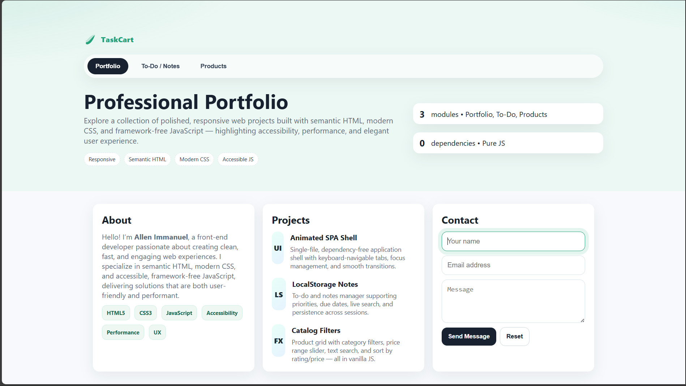
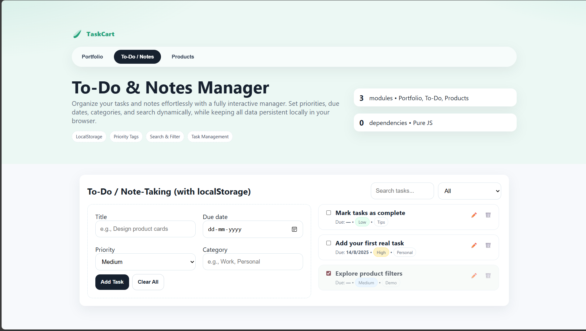
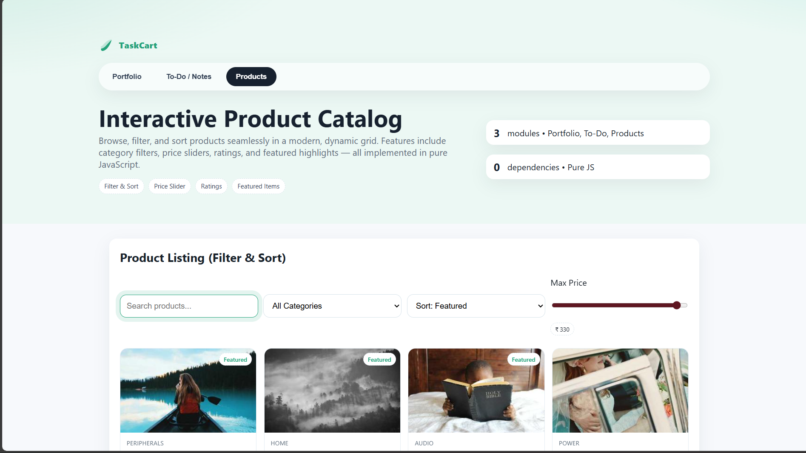

# TaskCart — Full Project Implementation

## Overview

TaskCart is a single-page web application built entirely with **HTML, CSS, and JavaScript**, without any external frameworks. It combines three core modules:

1. **Portfolio** — Showcase your professional skills and projects.
2. **To-Do / Notes Manager** — Organize tasks and notes with localStorage persistence.
3. **Product Listing** — Interactive product catalog with filtering, sorting, and price sliders.

The app is **responsive**, **accessible**, and optimized for performance.

---

## Features

### Portfolio Module

* Display your **About** section with skills.
* Showcase **projects** with descriptions and thumbnails.
* Contact form with localStorage demo message persistence.

### To-Do / Notes Module

* Add, edit, and delete tasks.
* Set **priority**, **due date**, and **category**.
* Filter by status (open/done) and search by title or category.
* Data persistence via `localStorage`.

### Product Catalog Module

* Browse products with images, categories, price, and ratings.
* Filter by **category**, **max price**, and search by title.
* Sort by **featured**, **rating**, or **price**.
* Mark products as featured.
* Interactive `Add to cart` demo (alerts only, no real cart integration).

### Accessibility & UX

* Keyboard navigation between tabs (`Ctrl+Alt+1/2/3`).
* Focus management for interactive elements.
* Responsive layout for desktop, tablet, and mobile.

---

## Screenshot
 
 
 
---

## Installation / Usage

1. Clone or download the repository.
2. Open `index.html` in a modern browser.
3. No server or build tools required.

---

## File Structure

```
/ (root)
├─ index.html       # Main HTML file
├─ styles.css       # CSS for styling all modules
├─ app.js           # JavaScript for interactivity
└─ README.md        # Project documentation
```

---

## How to Use

### Tabs Navigation

* Click on **Portfolio**, **To-Do / Notes**, or **Products** to switch modules.
* Keyboard shortcuts: `Ctrl+1` → Portfolio, `Ctrl+2` → To-Do, `Ctrl+3` → Products.

### To-Do / Notes

* Fill the form and click **Add Task**.
* Edit or delete tasks using action buttons.
* Filter tasks by status or search.
* Clear all tasks using **Clear All** button.

### Product Catalog

* Use search, category filter, and max price slider to narrow down products.
* Sort products using the dropdown.
* Click **Add to cart** for demo alert.

---

## Technologies Used

* **HTML5** — Semantic markup
* **CSS3** — Modern styling, responsive layout, gradients, shadows
* **JavaScript (ES6+)** — DOM manipulation, localStorage, dynamic rendering
* **No dependencies** — Fully vanilla JS solution

---

## Author

**Jenish Allen Immanuel J 💙** 

---

## License

This project is for demonstration and personal use.
